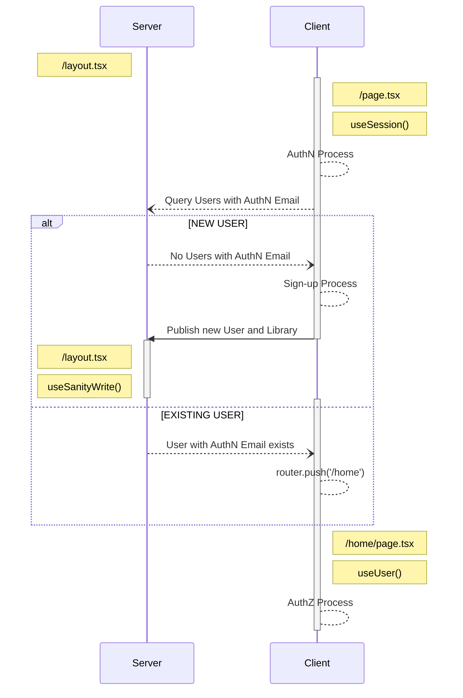

# AuthN / AuthZ Flow

```mermaid  fullWidth="false"
sequenceDiagram
  participant S as Server
  participant C as Client
  Note left of S: /layout.tsx
  activate C
  Note right of C: /page.tsx
  Note right of C: useSession()
  C-->C: AuthN Process
  C--)S: Query Users with AuthN Email
  alt NEW USER
  S--)C: No Users with AuthN Email
  C-->C: Sign-up Process
  C->>S: Publish new User and Library
  deactivate C
  activate S
  Note left of S: /layout.tsx
  Note left of S: useSanityWrite()
  deactivate S
  activate C
  else EXISTING USER
  S--)C: User with AuthN Email exists
  C-->C: router.push('/home');
  end
  Note right of C: /home/page.tsx
  Note right of C: useUser()
  C-->C: AuthZ Process
  deactivate C
```
