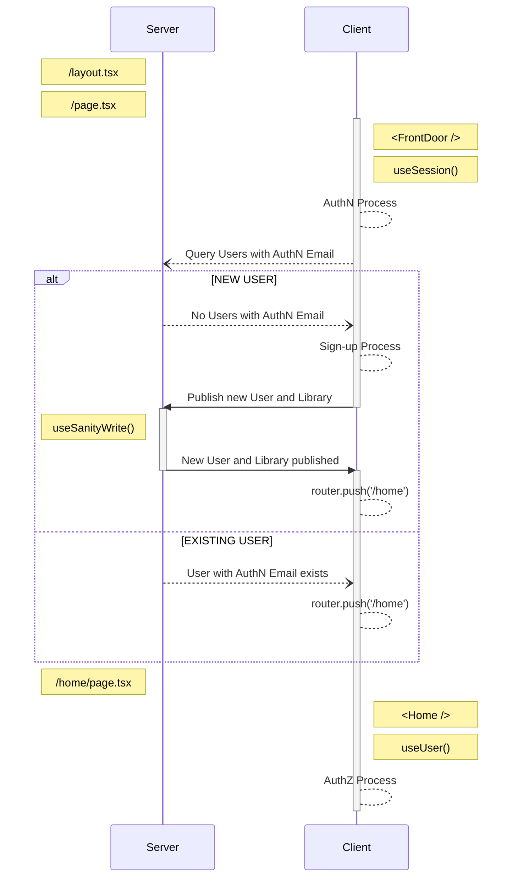

# AuthN / AuthZ Flow


Deprecated. Using Auth0 for AuthN/AuthZ now instead of Next-Auth.


```mermaid  fullWidth="false"
sequenceDiagram
  participant S as Server
  participant C as Client
  Note left of S: /layout.tsx
  Note left of S: /page.tsx
  activate C
  Note right of C: <FrontDoor />
  Note right of C: useSession()
  C-->C: AuthN Process
  C--)S: Query Users with AuthN Email
  alt NEW USER
  S--)C: No Users with AuthN Email
  C-->C: Sign-up Process
  C->>S: Publish new User and Library
  deactivate C
  activate S
  Note left of S: useSanityWrite()
  S->>C: New User and Library published
  deactivate S
  activate C
  C-->C: router.push('/home')
  else EXISTING USER
  S--)C: User with AuthN Email exists
  C-->C: router.push('/home')
  end
  Note left of S: /home/page.tsx
  Note right of C: <Home />
  Note right of C: useUser()
  C-->C: AuthZ Process
  deactivate C
```
