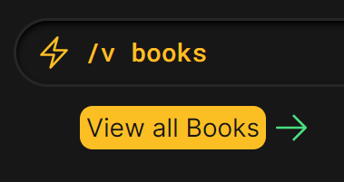

# Quick Start

<figure><figcaption></figcaption></figure>

## Commands

Select the Command Bar (or hit `ALT+/` to jump to it).  Typing a forward slash `/` activates the command mode:

<figure><figcaption></figcaption></figure>

These are the commands that are currently available (commands are not case-sensitive):

<table><thead><tr><th width="261">Command</th><th>Description</th></tr></thead><tbody><tr><td><code>/v books</code></td><td>View all Books</td></tr><tr><td><code>/v manga</code></td><td>View all Manga</td></tr><tr><td><code>/v tvseries</code></td><td>View all TV Series'</td></tr></tbody></table>

If you've entered a valid command, you'll see a green arrow appear:

<figure><figcaption></figcaption></figure>

Hit `Enter` to execute the command. ✅

## Hotkeys

Hold down the `ALT` key to show keyboard shortcuts hints.  Press the key that appears in the hint while holding `ALT` to execute the shortcut.

<figure><figcaption></figcaption></figure>
